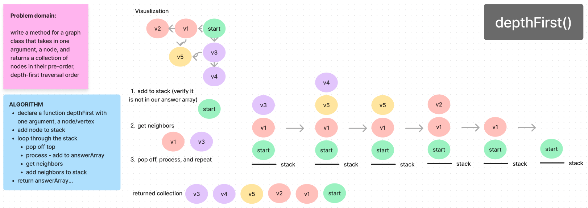

# Graph Depth-First Traversal

The depthFirst method employs the depth-first traversal technique to visit each node and its neighbors in a depth-first search manner, using a stack to manage the traversal order.

## Whiteboard

## Method Functionality

The method initiates the depth-first traversal from the specified start vertex, exploring adjacent nodes in a depth-first search pattern.

- A stack is utilized to keep track of the nodes during traversal.
- The starting vertex is pushed onto the stack.
- The method initializes an empty array, ansArr, to collect the visited nodes during the traversal.
- While the stack is not empty:
  - The top node (poppedVertex) is removed from the stack.
  - The removed node is added to the ansArr.
  - If the removed node has neighbors:
    - The method retrieves the neighbors of the removed node.
    - Each neighbor is pushed onto the stack for subsequent exploration.

## Return Value

The method returns 'ansArr', an array containing the nodes visited during the depth-first traversal in the order they were explored.
