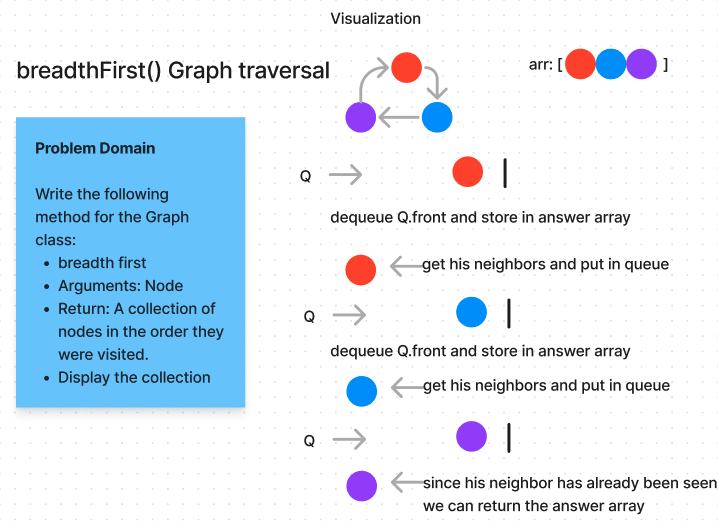

# Graph Breadth-First Traversal

The breadthFirst method in the Graph class facilitates the breadth-first traversal of nodes within a graph data structure. This method systematically explores all nodes by visiting adjacent nodes before moving on to the next level of adjacency.

## Whiteboard

## Usage

### Initializing a Graph

To use the breadthFirst method, you must first create an instance of the Graph class and populate it with nodes and edges.

Example:

const myGraph = new Graph();
const nodeA = myGraph.addVertex('A');
const nodeB = myGraph.addVertex('B');
myGraph.addEdge(nodeA, nodeB);

### Traversing the Graph

Once the graph is set up, you can use the breadthFirst method to perform the breadth-first traversal starting from a specific node within the graph.

Example:

const traversalResult = myGraph.breadthFirst(node);

## Method Details

The breadthFirst method:

- Accepts a starting node from which to begin the traversal.
- Explores the graph using a breadth-first approach.
- Returns an array (traversalResult) containing the nodes traversed in the order they were visited.

### Precautions

Ensure that the graph has nodes and edges connected properly before using the breadthFirst method to avoid unexpected results.

### Graph Class

The Graph class also provides various other functionalities, such as:

- Adding vertices and edges.
- Retrieving adjacent vertices and edges.
- Getting the total number of vertices in the graph.
