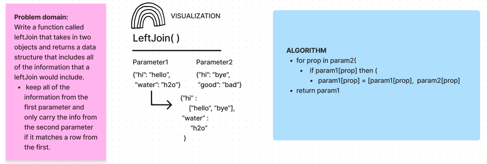

# leftJoin Function

The leftJoin function is a JavaScript utility that performs a "left join" operation on two objects. It takes two objects as input and returns a new object that combines information from both, following these rules:

- All information from the first object (ob1) is retained.
- Information from the second object (ob2) is included in the result if it matches a key from the first object.

