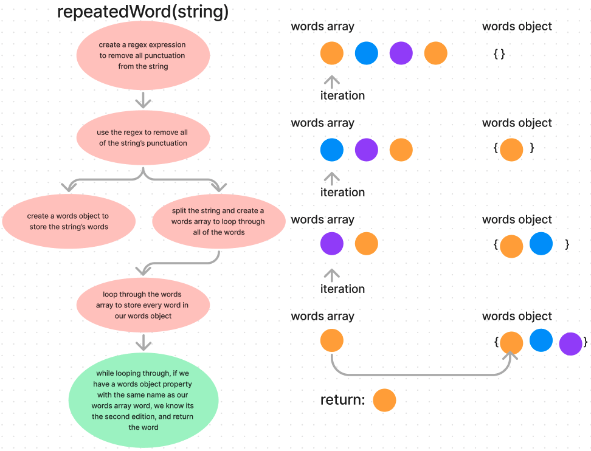

# Repeated Word Finder

A JavaScript function to find the first word that occurs more than once in a given text.

## Overview

This function takes a string of text as input and identifies the first word that occurs more than once within the text. It is designed to quickly find and return the repeated word to the caller.

## UML

