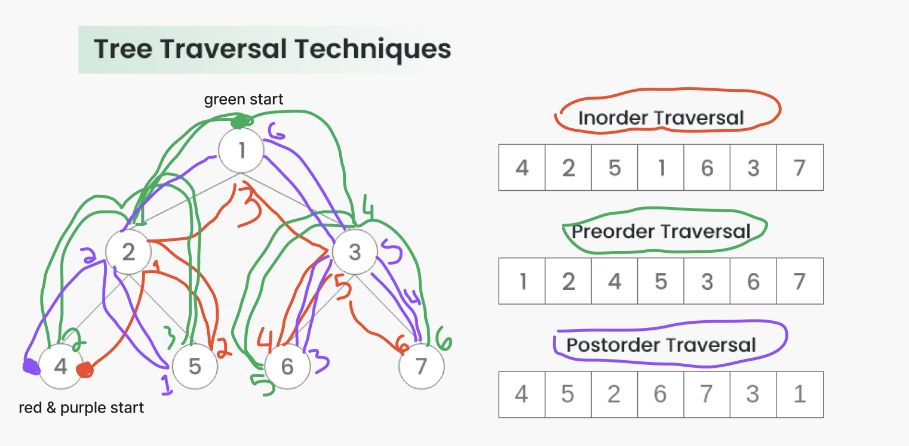
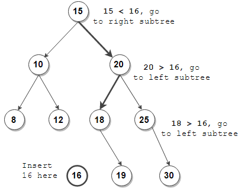
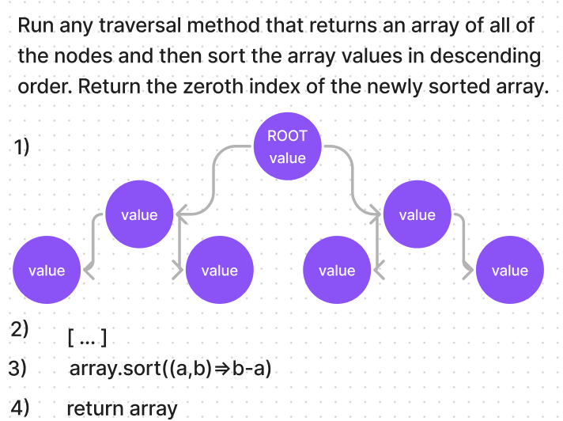

# Binary and Binary Search Tree classes

## Methods

### traversal
  - preOrder
  - inOrder
  - postOrder

### adding nodes
  - insert

### verifing values
  - contains

### return highest value
  - getMax

## Clean & Professional Traversal Methods UML

## Add Method UML (w/o helpful colors 🥲)

## getMax Method UML

