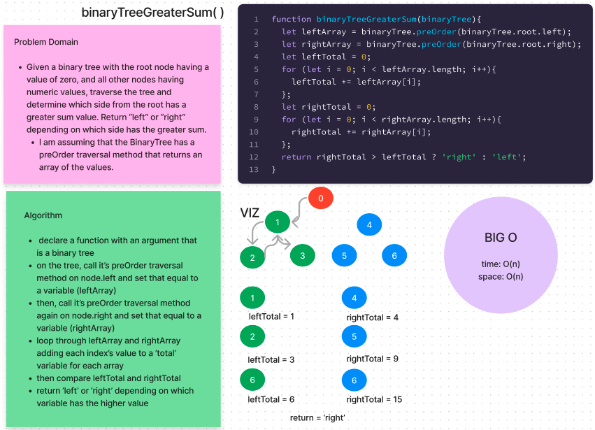

# Binary Tree Greater Sum

The binaryTreeGreaterSum function is designed to determine which side of a binary tree, from the root, possesses a greater total sum of node values, returning either "left" or "right" based on the calculation.

## Whiteboard

## Usage

### Parameters

binaryTree: The binary tree structure passed as an argument to the function. It is assumed that the tree object includes a preOrder method for traversing the tree and accessing its nodes.

### Return Value

Returns a string indicating which side of the root node has a greater sum: 'left' or 'right'.

## Important Notes

Please ensure the provided binary tree structure has the necessary preOrder method!
