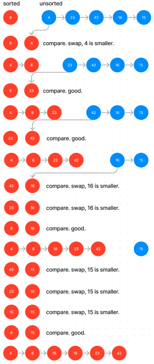

# Blog Notes: Insertion Sort

Insertion sort is a simple and efficient comparison-based sorting algorithm used to arrange a list of elements in ascending or descending order. It works by dividing the input list into two parts: a sorted subarray and an unsorted subarray. Initially, the sorted subarray contains only the first element of the input list, and the unsorted subarray contains the remaining elements.

The algorithm iterates through the unsorted subarray one element at a time, removing an element and inserting it into its correct position within the sorted subarray. This process continues until the entire list is sorted.

Here's a step-by-step description of the insertion sort algorithm:

Start with the first element as the sorted subarray.
Iterate through the unsorted subarray, starting with the second element.
For each element in the unsorted subarray, compare it to the elements in the sorted subarray from right to left until you find the correct position.
Insert the element into its correct position in the sorted subarray, shifting other elements to make space if necessary.
Repeat steps 2-4 until all elements in the unsorted subarray have been processed.

Below is a diagram of how [8, 4, 23, 42, 16, 15] becomes [4, 8, 15, 16, 23, 42] with an insertion sort.

This can be achieved in many ways.One of which is to create two functions that work in tandum with each other.

insert Function:

- insert takes two parameters: sortedArr, which is an already sorted array, and integer, which is an element that needs to be inserted into the sorted array.
- It initializes a variable i to 0.
- The first while loop iterates through sortedArr until it finds the correct position for integer. It does this by comparing integer with the elements in sortedArr from left to right until it finds an element greater than or equal to integer. It increments i in each iteration.
- After finding the correct position, the second while loop shifts the elements in sortedArr to the right to make space for integer. It temporarily stores the element at sortedArr[i] in a variable temp, then replaces sortedArr[i] with integer, and assigns temp to integer. This effectively inserts integer into its correct position in sortedArr.
- Finally, it pushes integer to the end of sortedArr to maintain the sorted order.

insertionSort Function:

- insertionSort takes an inputArr as its parameter, which is the unsorted array that needs to be sorted.
- It initializes an empty array sorted to hold the sorted elements.
- It sets sorted[0] to be the first element of inputArr, effectively initializing the sorted array with the first element from the input.
- It then iterates through the remaining elements of inputArr (starting from index 1) and calls the insert function to insert each element into the sorted array in its correct position.
- After all elements from inputArr have been inserted into sorted, it returns the sorted array.

So, the insert function is responsible for inserting a single element into a sorted array, and the insertionSort function uses this to build a sorted array from an unsorted input array by repeatedly inserting elements into it. The result is a sorted version of the input array.
