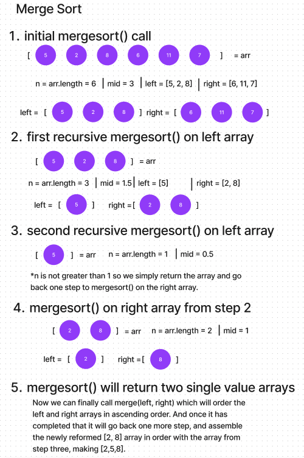

# Blog Notes: Merge Sort

Merge sort is a popular and efficient comparison-based sorting algorithm. It is a divide-and-conquer algorithm, that breaks down the sorting problem into smaller subproblems, solves them, and then combines the results to produce a sorted list.

Here's a few bullet points of how merge sort works:

- Divide: The unsorted list is divided into two equal halves (or approximately equal, with one being slightly larger if the list has an odd number of elements). This process is repeated recursively until each sub-list contains only one element.

- Conquer: Once the sub-lists are reduced to single elements, they are considered sorted.

- Merge: The sorted sub-lists are then merged back together to form larger and larger sub-lists until the entire list is sorted. During the merge phase, the elements from the two sub-lists are compared, and the smaller element is placed in the resulting merged list. This process is repeated until all elements are merged.

The key idea behind merge sort is that it is relatively easy to merge two sorted lists into one sorted list. This "divide and conquer" approach allows merge sort to achieve its efficient time complexity. However, it does require additional memory to store the sub-lists during the sorting process. This additional memory usage is sometimes a consideration when choosing a sorting algorithm. However in today's world, memory typically isn't the issue.

Here are my functions I use to complete amerge sort to create ordered arrays in ascending order:

function mergeSort(arr) {

  let n = arr.length;

  // Base case: if the array has 0 or 1 element, it's already sorted.

  if (n <= 1) {
    return arr;
  }

  let mid = Math.floor(n / 2);

  let left = arr.slice(0, mid);

  let right = arr.slice(mid);

  // Recursively sort both halves.

  left = mergeSort(left);

  right = mergeSort(right);

  // Merge the sorted halves.

  return merge(left, right);
}

function merge(left, right) {

  let result = [];

  let i = 0;

  let j = 0;

  while (i < left.length && j < right.length) {

    if (left[i] <= right[j]) {

      result.push(left[i]);

      i++;

    } else {

      result.push(right[j]);

      j++;

    }
  }

  // Add any remaining elements from both arrays.

  while (i < left.length) {

    result.push(left[i]);

    i++;

  }

  while (j < right.length) {

    result.push(right[j]);

    j++;

  }

  return result;
}

Below is a visual step through for how the first 'branch' of recursion works:

This would reform the left array from step one, and then we could remake this diagram for the 'right' array in step one. Ultimately reforming the entire arr variable from step one in ascending order.

I hope this was helpful!

Cheers!
